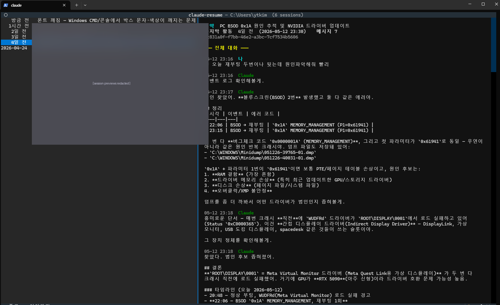

# claude-resume — 세션 피커 TUI

> 코드 리포: https://github.com/ytkim4558/claude-resume

## 한 줄 요약

`claude --resume` 의 기본 ID·시각 리스트를 **LLM 요약 기반 두-패널 TUI** 로 대체.
좌측에는 과거 세션별 LLM 요약이 보이고, 우측에는 선택한 세션의 전체 대화가 펼쳐진다.
요약은 백그라운드에서 `claude -p` 로 생성·캐시된다.

## 실행 모습



좌측 패널의 세션 미리보기 일부는 개인 정보 보호를 위해 가렸다. 실제 사용 시에는
각 세션의 첫 메시지와 LLM 자동 요약이 그 자리에 표시된다. 긴 히스토리를 직접
열어보지 않아도 "무슨 작업을 했던 대화인지"를 바로 찾는 것이 핵심 장점이다.

## 만든 배경

`claude --resume` 은 세션을 ID 와 생성 시각만으로 보여줘서, 며칠 전 대화를
이어가려고 할 때 어떤 게 어떤 세션인지 한눈에 안 들어옴. 첫 메시지 한 줄
미리보기조차 없다. 매번 ID 를 일일이 클릭해 확인하는 게 비효율적이라 직접 만듦.

## 설계 결정과 그 이유

### 1. **요약은 별도 LLM API 가 아니라 `claude -p` subprocess 로**

처음엔 Anthropic API 직접 호출(별도 API 키 + 종량제)을 검토했지만 다음 이유로
기각:
- 별도 결제 발생 (Claude Code Pro 구독비는 API 호출에 안 쓰임)
- API 키 보안 관리 부담 (`keyring` 등 추가 셋업 필요)
- 호출 빈도가 낮아서 `claude -p` 의 6초 지연을 백그라운드로 흡수 가능

결과적으로 **Pro 구독만으로 동작**, 사용자가 추가 설정할 게 없음.

### 2. **시간 기준은 파일 mtime 이 아니라 JSONL 내부 timestamp**

세션 정렬·표시용 "마지막 활동" 시각은 JSONL 파일의 mtime 이 아니라
**파일 안의 마지막 user/assistant 메시지의 timestamp 필드**를 쓴다.

이유: 요약을 별도 캐시(`~/.claude/session-summaries.json`)에 쓰지만, 나중에
다른 도구가 같은 디렉터리의 파일을 건드릴 수도 있고, 사용자 요청도 명확했음
— "LLM 돌렷다고 그 날짜 갱신시키지 말고".

### 3. **재귀 호출 방어 — 프롬프트 마커**

`claude -p "요약해줘 ..."` 호출이 그 자체로 **새 세션을 만든다**. 즉 다음번
피커 실행 시 그 요약 호출 세션이 또 피커에 뜨고, 그걸 또 요약하려 하고...
무한 증식.

해결: 요약 프롬프트 첫 줄에 `<<CLAUDE-RESUME-SUMMARY-V1>>` 마커를 박고,
세션의 첫 user 메시지에 이 마커가 있으면 리스트에서 제외.
레거시(마커 없던 시절) 세션도 프롬프트 접두사 매칭으로 함께 필터.

### 4. **CMD / PowerShell 양쪽에서 동일 명령어로 호출**

- `claude-resume.py` (Python, 실제 TUI)
- `claude-resume.ps1` (PowerShell 래퍼 — 인코딩 강제, 환경변수, 핸드오프)
- `claude-resume.cmd` (CMD 호환 shim — `.ps1` 를 `-NoProfile -ExecutionPolicy Bypass` 로 호출)

`~/.claude/scripts/` 를 PATH 에 추가하면 어느 셸에서든 `claude-resume` 동작.

### 5. **선택 핸드오프는 임시 파일 경유**

Textual TUI 에서 사용자가 선택하면 stdout 으로 ID 를 출력하지 않고
`~/.claude/.resume-target` 파일에 쓴 뒤 종료. PowerShell 래퍼가 그 파일을
읽어 `claude --resume <id>` 를 실행.

이유: Textual 이 stdout 을 TUI 렌더링에 점유해서 일반 출력 채널로 못 씀.

## 트러블슈팅 일지

작업 중 마주친 문제 및 해결:

### 한글 인코딩 (PowerShell ↔ subprocess)

증상: `claude -p` 에 한글 프롬프트 전달 시 `???` 로 깨짐.

원인: PowerShell 의 기본 stdin/stdout 인코딩이 UTF-16 LE 또는 OEM 코드페이지.

해결: PowerShell 래퍼에서 환경변수 설정:
```powershell
$env:PYTHONIOENCODING = 'utf-8'
$env:PYTHONUTF8       = '1'
[Console]::OutputEncoding = [System.Text.UTF8Encoding]::new()
[Console]::InputEncoding  = [System.Text.UTF8Encoding]::new()
```
Python 측에서는 `subprocess.run([...], capture_output=True)` 후 직접
`.decode("utf-8", errors="replace")` 로 디코딩.

### Textual ListView 의 Enter 키가 안 먹음

증상: 화살표로 항목 이동은 되는데 Enter 가 무반응.

원인: 앱 레벨에 `Binding("enter", "resume", ...)` 을 걸어뒀더니 ListView
내장 Enter 핸들러(`ListView.Selected` 이벤트)를 가로채서 둘 다 무력화됨.

해결: 앱 레벨 Enter 바인딩 제거하고 `on_list_view_selected` 이벤트 핸들러로
처리. `s` 키를 백업 단축키로 추가. `on_mount` 에서 `lv.focus()` 명시.

### Windows CMD 에서 폰트가 fallback

증상: TUI 띄우면 한글이 영문 폰트와 다른 폰트로 보임 (어색하게 섞임).

원인: 터미널 기본 모노스페이스 폰트(Cascadia Mono 등)에 한글 글리프 없음
→ Windows 가 맑은 고딕 등으로 자동 fallback.

해결책 (사용자 안내): Windows Terminal + D2Coding/Sarasa Mono K 같은
CJK 통합 코딩 폰트로 변경. `chcp 65001` 도 래퍼에서 자동 실행하지만
근본은 폰트 문제.

## 사용법

```powershell
claude-resume              # 인터랙티브 피커
claude-resume -List        # stdout 리스트 (스크립팅용)
claude-resume -Probe       # 환경 진단
```

조작은 [README](https://github.com/ytkim4558/claude-resume#조작) 참고.

## 향후 개선 후보

- [ ] `--all` 옵션 — 현재 디렉터리 외 다른 프로젝트 세션도 묶어서 표시
- [ ] 키워드 검색 (`/` 로 시작) — Textual 내 inline filter
- [ ] 세션 삭제 (`d` 키) — JSONL 과 캐시 항목 동시 제거, 확인 프롬프트
- [ ] 요약 모델 옵션화 — `claude -p` 대신 OpenAI/Gemini 등 선택 가능
- [ ] macOS / Linux 래퍼 — `.sh` 버전 (Python 본체는 이미 크로스플랫폼)
